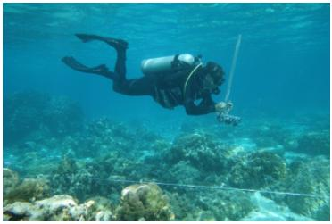
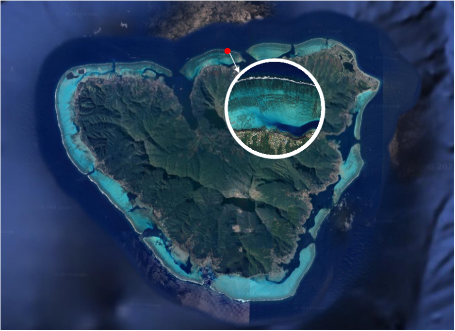
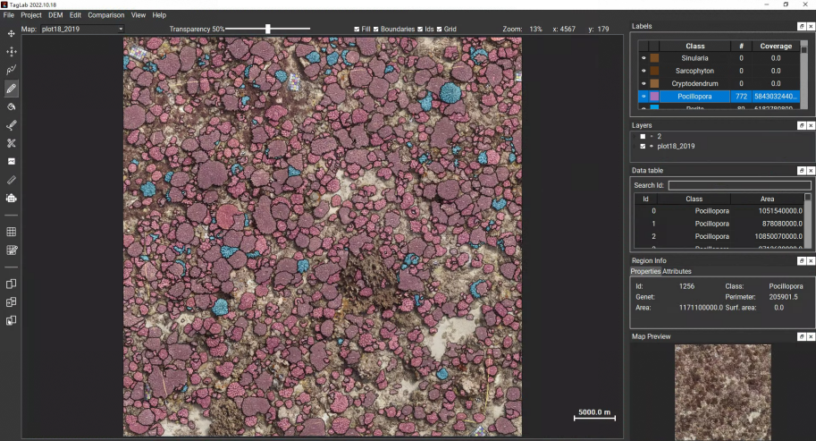
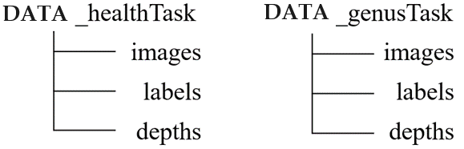

# Moorea Orthophoto Dataset (MOD)

## Moorea IDEA Project

The goal of the Moorea Island Digital Ecosystem Avatar Research Program is to explore the impact of external drivers, such as disturbances and global climate change, on the resilience of coral reefs. Photogrammetric surveys have been conducted in several reef tracts of Moorea since 2005, typically at a depth of around 10 meters. During regular field surveys, a camera system is utilized that captures time series data with high image overlap from five different points of view. Additionally, the system collects camera altitude data from the reef substrate and GPS data to facilitate more precise 3D reconstructions.

__Figure 1__. Field study with a camera system.

## Dataset Description

- The published dataset comprises one reef plot, which encompasses an area of approximately 49 m² (7 m * 7 m) of the seafloor.
- It includes human-classified semantic annotations for training and validation images, featuring two primary coral classes (Acropora and Pocillopora) and three health states (live coral, dead coral, and bleached coral). All data were systematically gathered in Moorea, French Polynesia (17°30′S, 149°50′W) during the period spanning from 2017 to 2019.

__Figure 2__. Location of the survey (red dot). Background imagery reproduced from the Google Earth (https://www.google.cn/intl/zh-en/earth).

## Methodology

Calibration parameters were set for each camera at a test site to ensure consistency in factors such as focal length and distortion. These calculated calibration parameters were then applied to all acquired images, thereby minimizing distortion effects. Adobe Camera Raw software was employed for chromatic aberration correction. The height of the camera from the benthos is about 2m. Subsequently, the acquired data was imported into the photogrammetry software, Agisoft Metashape, to obtain the product set, including sparse point cloud, dense point cloud, mesh model, orthophoto, and depth image. An orthophoto is a type of remote sensing imagery that has been geometrically corrected to make them evenly proportioned, with accurate georeferencing, a top-down view, and reduced distortions. The depth image provides the distance relationship from the camera to each coral individual, which directly reflects the geometry of the visible surface. Each image has a consistent spatial resolution of 1mm/pixel.

Image annotation was performed using the semi-automated annotation tool, TagLab (more details at https://github.com/cnr-isti-vclab/TagLab). When selecting four points at the extremities of each object, the interactive segmentation model discerns and delineates the intricate contours of the coral's complex zones. Subsequent to contour generation, the utilization of an automatic refinement tool (Ctrl+R) enhances segmentation precision. TagLab’s interactive annotation interface is shown in Figure 3.

__Figure 3__. Interactive annotation interface of TagLab. The toolbar is located on the left side, and the color label and number of markers are displayed on the right side. For convenience, we have assigned the tag for 'pocillopora' as 'living coral' in our labeling system. For a detailed information of classes and their corresponding RGB values, please refer to the README.md.

## Dataset Organization

- __Organization and Size__: The image patches in this dataset are sampled from images of the same geographical area over a period of three years using the Poisson sampling method. The images are in JPG format, and the files are grouped according to annotation standards. The task labeled with different health states contains 2,797 patches, each with a size of 300x300 pixels, and the task labeled with different genera contains 1,213 patches, also each with a size of 300x300 pixels. To facilitate data management, image patches, image annotations, and depth images related to each task are stored in separate folders. See Figure 4 for the hierarchical structure of the dataset.

__Figure 4__. Hierarchical structure of photo-patch dataset. The image files under each task correspond to different image annotations. Since Poisson disk sampling is used, the image patches sampled by each task are not the same.

- __Naming Convention__: Each image file within this dataset is meticulously structured and comprises three distinct components delineated by underscores. These components include the category to which the sampling center pertains, the year in which the image was captured, and finally, the unique serial number assigned to each image. Examples that follow this nomenclature include: pocill17_1, acro18_3, bleach19_19, dead18_288, and live17_282. 

- __Annotated images__: See the README.md for the RGB labels of the categories involved in each task.

## Download

You can download the Moorea Orthophoto Dataset [here](https://markdown.com.cn).

## Publications
Examples of peer-reviewed publications based on this dataset:
- Zhang H, Grün A, Li M. 2022. Deep learning for semantic segmentation of coral images in underwater photogrammetry. ISPRS Annals of the Photogrammetry, Remote Sensing and Spatial Information Sciences, 2: 343-350.
- Zhong J, Li M, Zhang H, et al. 2023. Combining Photogrammetric Computer Vision and Semantic Segmentation for Fine-grained Understanding of Coral Reef Growth under Climate Change. IEEE/CVF Winter Conference on Applications of Computer Vision. 186-195.
- Zhong J, Li M, Zhang H, et al. 2023. Fine-Grained 3D Modeling and Semantic Mapping of Coral Reefs Using Photogrammetric Computer Vision and Machine Learning. Sensors, 23(15): 6753.
- Zhang H, Li M, Zhong J, et al. 2024. CNet: A Novel Seabed Coral Reef Image Segmentation Approach Based on Deep Learning. IEEE/CVF Winter Conference on Applications of Computer Vision. 767-775.

## License
A condition of the use of this data is that it is appropriately cited, attributed and derived datasets are shared under similar terms.

## Citation for this dataset
The citation for this dataset is:
- Li M, Zhang H, Gruen A, Li D. A Survey on Underwater Coral Image Segmentation Based on Deep Learning.
